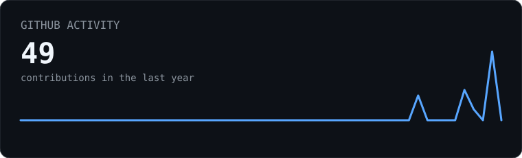
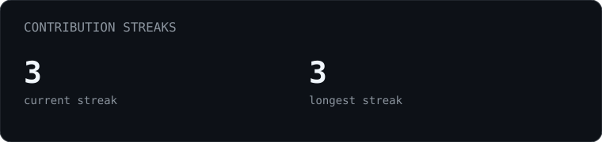
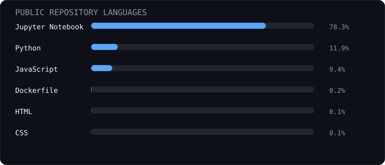
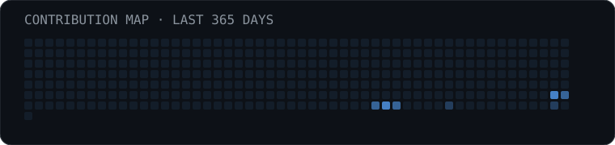

<div align="center">


# MUKESH SHARMA

### DATA SCIENCE | AI | MACHINE LEARNING

**Turning data into useful insights and intelligent systems.**

[LinkedIn](https://www.linkedin.com/in/mukesh-sharma-95a14232/) | [GitHub](https://github.com/GalacticBear)

</div>

---

## `01 / PROFILE`

Computer Science Engineering student building toward **Data Science, Machine Learning, and AI** roles.

I like working at the intersection of **data, models, and software** - from understanding a dataset and training a model to turning the result into a practical application.

**Career direction:** `Data Scientist` | `ML Engineer` | `AI Engineer`

---

## `02 / WHAT I'M FOCUSING ON`

| Area | Focus |
| --- | --- |
| **Data Science** | Data cleaning | EDA | statistics | visualization | SQL |
| **Machine Learning** | Predictive modeling | feature engineering | model evaluation |
| **AI** | Deep learning | NLP | LLMs | generative AI |
| **AI Engineering** | APIs | applications | deployment | reproducible workflows |

---

## `03 / TOOLKIT`

**Programming & Data**

`Python` | `SQL` | `NumPy` | `Pandas`

**Machine Learning & AI**

`Scikit-learn` | `Machine Learning` | `Deep Learning` | `NLP` | `Generative AI`

**Engineering**

`JavaScript` | `React` | `Node.js` | `REST APIs` | `Git` | `GitHub` | `Docker` | `Cloud`

**Tools**

`VS Code` | `Postman` | `Google Cloud Platform`

> I keep this section focused on technologies I use or am actively developing with; it will evolve as my projects do.

---

## `04 / SELECTED WORK`

### CareerForge-AI

**AI-powered career preparation platform**

A practical full-stack AI application focused on resume analysis, semantic job matching, skill-gap identification, personalized career guidance, and interview practice.

**What it demonstrates:** AI application development | semantic matching | full-stack engineering | product thinking

[View the CareerForge-AI repository](https://github.com/GalacticBear/CareerForge-AI)

---

### AI Driven Student Performance Prediction System

**Machine learning & data-driven prediction**

A machine-learning project involving predictive modeling, sentiment analysis, and data pipelines for student-performance analysis.

**What it demonstrates:** machine learning | data processing | predictive analytics

[View the Student Performance Prediction repository](https://github.com/GalacticBear/AI-Driven-Student-Performance-Prediction-System)

---

## `05 / GITHUB ACTIVITY`

<div align="center">









</div>

---

## `06 / CURRENTLY BUILDING TOWARD`

```text
DATA
 |
 +-- SQL + data manipulation
 +-- statistics + experimentation
 +-- analysis + visualization
          |
          v
MACHINE LEARNING
 |
 +-- supervised / unsupervised learning
 +-- feature engineering
 +-- evaluation + validation
          |
          v
DEEP LEARNING
 |
 +-- neural networks
 +-- representation learning
          |
          v
GENERATIVE AI
 |
 +-- NLP + LLMs
 +-- AI-powered applications
          |
          v
AI ENGINEERING
     build -> evaluate -> deploy

---

## `07 / WHAT I WANT TO SHOW THROUGH MY PROJECTS`

I am intentionally building projects that demonstrate more than a model notebook:

- **Problem definition** - what question is being solved?
- **Data work** - cleaning, exploration, features, and assumptions.
- **Modeling** - baseline, experiments, evaluation, and interpretation.
- **Engineering** - turning useful models into usable applications.
- **Communication** - clear README files, results, limitations, and next steps.

This is the standard I want my future Data Science and AI projects to follow.

---

## `08 / LEARNING ROADMAP`

```text
[01] Statistics & probability
[02] Data analysis & visualization
[03] Machine learning
[04] Deep learning
[05] NLP & LLMs
[06] Generative AI
[07] MLOps & AI deployment

---

## `09 / CONNECT`

<div align="center">

**Interested in data, AI, or building something useful?**

[LinkedIn](https://www.linkedin.com/in/mukesh-sharma-95a14232/) | [GitHub](https://github.com/GalacticBear)

</div>

---

<sub>Profile activity is generated automatically with Python and GitHub Actions.</sub>

